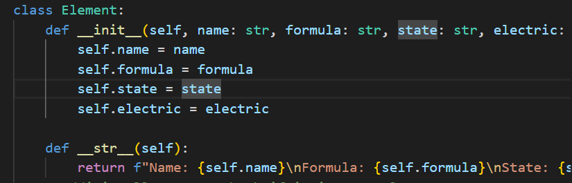

# Classes

my first shot at classes in python, not the prettiest or most organized files that i created but they certainly helped me understand the fundamentals of classes a lot more!

both files include 3 classes that all do slightly different thigns
one class get's constructed via a loop as well

not much more to say 
